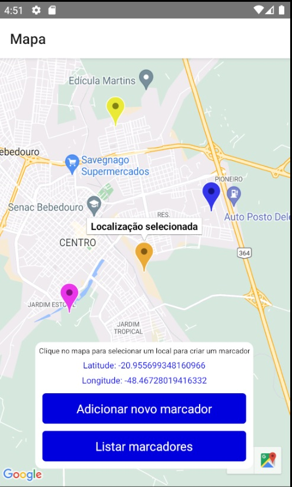

# Aplicativo mapa com marcadores
Aplicativo sem uso específico, feito em pós graduação mobile, para aprendizado da criação de apps com mapa no React Native.

## Tecnologias utilizadas

- Mapa com a biblioteca react-native-maps
- Localização em tempo real com a biblioteca react-native-geolocation-service
- Context provider
- Navigators
- useState
- useEffect

## Prints da aplicação:

### Tela de mapa com localização selecionada

### Tela de adicionar marcador, acessada pelo botão "Adicionar novo marcador"

### Mapa com o novo marcador adicionado

### Listagem de marcadores existentes, acessada pelo botão "Listar marcadores", é possível centralizar uma localização no mapa no botão "Ver no mapa"

